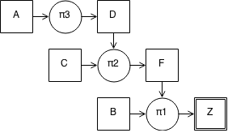
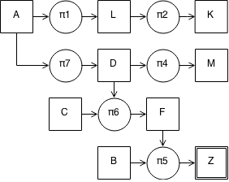
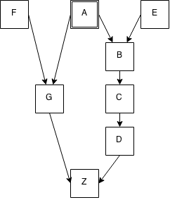
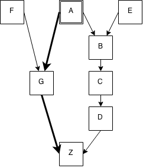
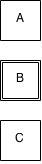
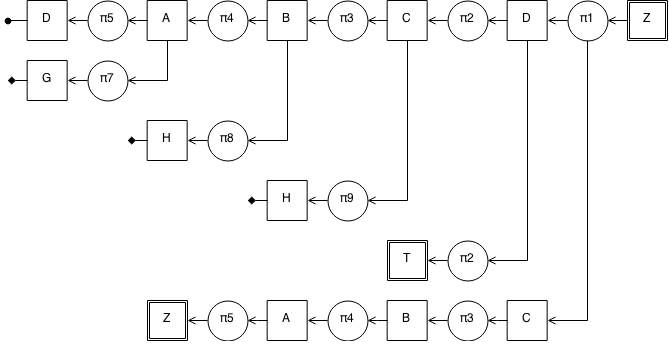
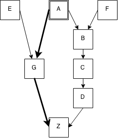

# Forward- and backward-chaining on Rules

## Artificial Intelligence

### Andre Nanninga<br><sub>ag.nanninga@gmail.com</sub>

<p style="page-break-after:always;"></p>

## Introduction

Forward- and Backward-chaining are two rule-based systems where by using a set of IF-THEN production rules and set of known facts a solution to a wanted goal is produced. This solution is the order in which the rules is applied to reach the goal.

The facts in the production rules are represented by letters in this algorithm. Each rule consists of antecedents (condition) and a consequent (action). When all antecedents are present in the known facts then the consequent can be derived and thus added to the known facts. The set of known facts is thus expanded and may lead to new rules where all antecedents are present in the known facts.

As an example consider the following example: Suppose the set of known facts initialy consists of facts `A`, `B` and `C` and the knowledge base contains the following rules

```text
Rule 1: IF (F is true AND B is true)
        THEN (Z is true)

Rule 2: IF (C is true AND D is true)
        THEN (F is true)

Rule 3: IF (A is true)
        THEN (D is true)
```

The reach the goal of fact Z the system applies any rule of which antecedents are all present in the facts.

Both `Rule 1` and `Rule 2` cannot be applied as not all of their antecedents are in the facts. For `Rule 1` the antecedent of `F` is missing and for `Rule 2` the antecedent D is missing. However `Rule 3` can be applied as `A` is in the facts. Thus the system can infer that `D` is also true. After applying the rule the set of facts consists of `A`, `B`, `C` and `D`.

Repeating this progress the system then can apply `Rule 2` and lastly `Rule 1`. This leads the solution of `Rule 3`, `Rule 2` and `Rule 1`. The following graph is a graphical representation of this progress.



The system must decide when the rules have to be applied. There are two methods in which this can be achieved. One being forward-chaining and the other backward-chaining.

## Forward-Chaining

Forward-chaining is an algorithm to gain information from a known set of information. By using a set of rules the algorithm can deduce new information. Each rule describes what facts result to what information. The algorithm will apply all possible rules until all rules are exhausted or the goal is found.

In the following section the working of the algorithm is explained along with an implentation of the algorithm in  _JavaScript_.

### Algorithm

```text
input:  Knowledge base <facts, rules>, goal <goal>
output: Sequence of rules <solution>

solution = ∅

while (goal is not found) do
   foreach (rule in rules) do
      if (goal is derived) then 
         return solution
      if (rule is redundant) then
         remove rule from rules
      if (rule is applictable) then
         add rule to solution
         add consequent to facts
         remove rule from rules
      if (no rule is applictable) then
         return ∅
return solution
```

### Implementation

The algorithm is implemented in `JavaScript`.

```javascript
var forwardChaining = function(rules, facts, goal) {
  var finished = false;
  var iterations = 0;
  var solution = [];

  while(!finished) {
    // check if the goal is present in the facts
    if(_.contains(facts, goal)) {
      console.log('goal is found');
      finished = true;
      break;
    }

    iterations += 1;

    // prevent infinite loops by setting an upper limit of iterations
    if(iterations > 100) {
      console.log('too many iterations');
      finished = true;
      break;
    }

    // loop over every rule and try to apply it
    // if it is succesfully applied it returns true otherwise it returns false
    var rulesApplied = _.map(rules, function(rule) {
      // check if the rule was already applied or was made redundant
      if(rule.applied || rule.redundant) {
        return false;
      }

      // if the consequent of the rule is already in the facts then we can mark
      // it as redundant
      if(_.contains(facts, rule.consequent)) {
        rule.deprecate();
        return false;
      }

      // check if all the antecedents of the rule are present in the facts
      if(rule.match(facts)) {
        console.log(iterations + ': applied rule ' + rule.toString() + ' on ' + facts);

        // apply the rule
        rule.apply();
        solution.push(rule);
        facts.push(rule.consequent);

        return true;
      }

      return false;
    });

    // check if any rule was applied
    // if no rule was applied then we cannot find a solution to the goal
    if(_.none(rulesApplied)) {
      console.log('failed to find a solution');
      solution = [];
      finished = true;
      break;
    }
  }

  return solution;
};
```

### Tests

In the following section the working of the implementation is presented along with a corresponding graphical representation. Each test is meant to represent a different usecase.

#### Basic rules

```text
facts:  A,B,C
rules:  [π1] F, B → Z
        [π2] C, D → F
        [π3] A → D
goal:   Z
─────────────────────────────
forward chaining

1: applied rule [π3] A → D on A,B,C
2: applied rule [π2] C, D → F on A,B,C,D
2: skipped rule [π3] A → D already applied
3: applied rule [π1] F, B → Z on A,B,C,D,F
3: skipped rule [π2] C, D → F already applied
3: skipped rule [π3] A → D already applied
goal is found
─────────────────────────────
result:
[π3]  [π2]  [π1] 
```


#### Basic rules with solution in facts

```text
facts:  A,B,C
rules:  [π1] A, B → C
        [π2] D, E → F
        [π3] T, D → A
        [π4] K, J → A
goal:   B
─────────────────────────────
forward chaining

goal is found
─────────────────────────────
result:
[]
```


#### No solution

```text
facts:  A,B,C
rules:  [π1] F, B → Z
        [π2] C, D → F
        [π3] E → D
        [π4] A, B → G
goal:   Z
─────────────────────────────
forward chaining

1: applied rule [π4] A, B → G on A,B,C
2: skipped rule [π4] A, B → G already applied
failed to find a solution
─────────────────────────────
result:
[]
```

#### Redundant rules

```text
facts:  A,B,C
rules:  [π1] A → L
        [π2] L → K
        [π3] D → A
        [π4] D → M
        [π5] F, B → Z
        [π6] C, D → F
        [π7] A → D
goal:   Z
─────────────────────────────
forward chaining

1: applied rule [π1] A → L on A,B,C
1: applied rule [π2] L → K on A,B,C,L
1: applied rule [π7] A → D on A,B,C,L,K
2: skipped rule [π1] A → L already applied
2: skipped rule [π2] L → K already applied
2: skipped rule [π3] D → A is redundant
2: applied rule [π4] D → M on A,B,C,L,K,D
2: applied rule [π6] C, D → F on A,B,C,L,K,D,M
2: skipped rule [π7] A → D already applied
3: skipped rule [π1] A → L already applied
3: skipped rule [π2] L → K already applied
3: skipped rule [π3] D → A is redundant
3: skipped rule [π4] D → M already applied
3: applied rule [π5] F, B → Z on A,B,C,L,K,D,M,F
3: skipped rule [π6] C, D → F already applied
3: skipped rule [π7] A → D already applied
goal is found
─────────────────────────────
result:
[π1]  [π2]  [π7]  [π4]  [π6]  [π5]  
```



### Rule definition ordering

In the following tests it is shown that the ordering of the rules can have an influence on the solution when there are multiple solutions possible. The tests are preformed on a graph with the following layout.



#### First ordering of rules

```text
facts:  A
rules:  [π1] E → G
  [π2] F → B
  [π3] G → Z
  [π4] A → B
  [π5] B → C
  [π6] C → D
  [π7] D → Z
  [π8] A → G
goal: Z
─────────────────────────────
forward chaining

1: applied rule [π4] A → B on A
1: applied rule [π5] B → C on A,B
1: applied rule [π6] C → D on A,B,C
1: applied rule [π7] D → Z on A,B,C,D
1: applied rule [π8] A → G on A,B,C,D,Z
goal is found
─────────────────────────────
result:
[π4]  [π5]  [π6]  [π7]  [π8]  
```


#### Second ordering of rules

```text
facts:  A
rules:  [π1] A → G
  [π2] G → Z
  [π3] E → G
  [π4] F → B
  [π5] A → B
  [π6] B → C
  [π7] C → D
  [π8] D → Z
goal: Z
─────────────────────────────
forward chaining

1: applied rule [π1] A → G on A
1: applied rule [π2] G → Z on A,G
1: applied rule [π5] A → B on A,G,Z
goal is found
─────────────────────────────
result:
[π1]  [π2]  [π5]
```



The above two tests both find a solution but the order of the rules has an influence on which solution is finally presented. As a result the forward-chaining algorithm can not guarantee that the most optimal solution is found.

## Backward Chaining

Backward-chaining is an algorithm to gain information from a known set of information. By using a set of rules the algorithm can deduce new information. Each rule describes what facts result to what information. The algorithm will apply all possible rules until all rules are exhausted or the goal is found.

In the following section the working of the algorithm is explained along with an implentation of the algorithm in  _JavaScript_.

### Algorithm


```text
input:  Knowledge base <facts, rules>, goal <goal>
output: Sequence of rules <solution>

solution = ∅, tempFacts = ∅

while (not all facts are derived) do
  if (goal is valid) then
    add goal to tempFacts
    foreach (rule in rules) do
      if (rule implies goal) then
        add rule to result
        foreach antedent in rule do
          BackwardChaining(facts, rules, goal = antecedent)
      if (success) then
        tempFacts = ∅
        add rule to solution
  else
    remove goal from tempFacts
  if (no goal is valid) do
    reutrn ∅
return solution
```

### Implementation

The algorithm is implemented in `JavaScript`.

```javascript
BackwardChain.prototype.solver = function(goal) {
  this.depth += 1;

  var ruleUsed = false;

  // we want to represent the depth with tabs
  var pad = tab(this.depth);
  var goalText = pad + 'goal is ' + goal + '. ';

  // check if the goal is already present
  if(_.contains(this.allFacts, goal)) {
    if(_.contains(this.facts, goal)) {
      util.print(goalText + 'goal is in the original facts.\n');
    }
    else {
      util.print(goalText + 'goal was previously deduced.\n');
    }

    this.depth -= 1;
    return true;
  }

  // check if the goal is already derived thus causing a loop
  if(_.contains(this.searchFacts, goal)) {
    util.print(goalText + 'Was already used to derive, leads to a loop.\n');
    this.depth -= 1;
    return false;
  }

  // add the goal to searchFacts
  this.searchFacts.push(goal);

  // loop through all rules
  for(var i = 0; i < this.rules.length; i++) {
    var rule = this.rules[i];
    var branches = [];

    // check if the rule was already applied or was made redundant
    if(rule.applied || rule.redundant) {
      continue;
    }

    // check if the rule has the current goal as the consequent
    if(rule.consequent === goal) {
      ruleUsed = true;
      util.print(goalText + 'Trying ' + rule.toString() + 
        ' | trying to derive ' + rule.antecedents + '.\n');

      // for every antecedent we recursivly try to derive
      for(var j = 0; j < rule.antecedents.length; j++) {
        var antecedent = rule.antecedents[j];
        branches.push(this.solver(antecedent));
      }

      // if every antecedent could be derived then we can add it to our solution
      if(_.every(branches)) {
        if(_.intersection(rule.antecedents, this.allFacts).length 
          === rule.antecedents.length) {
          this.searchFacts = _.without(this.searchFacts, goal);
          this.allFacts.push(rule.consequent);
          this.solution.push(rule);
          rule.apply();
          this.depth -= 1;

          return true;
        }
      }
    }
  }

  // when no rule was applicable then we reach a deadend 
  if(!ruleUsed) {
    // deadend
    util.print(goalText + 'no possible rule available, deadend.\n');
  }

  this.searchFacts = _.without(this.searchFacts, goal);
  this.depth -= 1;

  return false;
};
```

### Tests

In the following section the working of the implementation is presented along with a corresponding graphical representation. Each test is meant to represent a different usecase.

#### Basic rules

```text
facts:  A,B,C
rules:  [π1] F, B → Z
  [π2] C, D → F
  [π3] A → D
goal: Z
─────────────────────────────
backward chaining

goal is Z. Trying [π1] F, B → Z | trying to derive F,B.
  goal is F. Trying [π2] C, D → F | trying to derive C,D.
    goal is C. goal is in the original facts.
    goal is D. Trying [π3] A → D | trying to derive A.
      goal is A. goal is in the original facts.
  goal is B. goal is in the original facts.
─────────────────────────────
result:
[π3]  [π2]  [π1]  
```


#### Basic rules with solution in facts

```text
facts:  T
rules:  [π1] A, B → C
  [π2] D, E → F
  [π3] T, D → A
  [π4] K, J → A
goal: T
─────────────────────────────
backward chaining

goal is T. goal is in the original facts.
─────────────────────────────
result:
[]
```



#### No solution

```text
facts:  A,B,C
rules:  [π1] F, B → Z
  [π2] C, D → F
  [π3] E → D
  [π4] A, B → G
goal: Z
─────────────────────────────
backward chaining

goal is Z. Trying [π1] F, B → Z | trying to derive F,B.
  goal is F. Trying [π2] C, D → F | trying to derive C,D.
    goal is C. goal is in the original facts.
    goal is D. Trying [π3] E → D | trying to derive E.
      goal is E. no possible rule available, deadend.
  goal is B. goal is in the original facts.
failed to find solution
─────────────────────────────
result:
[]
```

#### Advanced rules

```text
facts:  T
rules:  [π1] D, C → Z
        [π2] C → D
        [π3] B → C
        [π4] A → B
        [π5] D → A
        [π6] T → D
        [π7] G → A
        [π8] H → B
        [π9] J → C
goal:   Z
─────────────────────────────
backward chaining

goal is Z. Trying [π1] D, C → Z | trying to derive D,C.
  goal is D. Trying [π2] C → D | trying to derive C.
    goal is C. Trying [π3] B → C | trying to derive B.
      goal is B. Trying [π4] A → B | trying to derive A.
        goal is A. Trying [π5] D → A | trying to derive D.
          goal is D. Was already used to derive, leads to a loop.
        goal is A. Trying [π7] G → A | trying to derive G.
          goal is G. no possible rule available, deadend.
      goal is B. Trying [π8] H → B | trying to derive H.
        goal is H. no possible rule available, deadend.
    goal is C. Trying [π9] J → C | trying to derive J.
      goal is J. no possible rule available, deadend.
  goal is D. Trying [π6] T → D | trying to derive T.
    goal is T. goal is in the original facts.
  goal is C. Trying [π3] B → C | trying to derive B.
    goal is B. Trying [π4] A → B | trying to derive A.
      goal is A. Trying [π5] D → A | trying to derive D.
        goal is D. goal was previously deduced.
─────────────────────────────
result:
[π6]  [π5]  [π4]  [π3]  [π1]  
```



### Deadend

```text
facts:  A
rules:  [π1] E → G
  [π2] F → B
  [π3] G → Z
  [π4] A → B
  [π5] B → C
  [π6] C → D
  [π7] D → Z
  [π8] A → G
goal: Z
─────────────────────────────
backward chaining

goal is Z. Trying [π3] G → Z | trying to derive G.
  goal is G. Trying [π1] E → G | trying to derive E.
    goal is E. no possible rule available, deadend.
  goal is G. Trying [π8] A → G | trying to derive A.
    goal is A. goal is in the original facts.
─────────────────────────────
result:
[π8]  [π3]  
```



In this test we can see that the rule `[π1]` is attempted it leads to a deadend when `E` could not be derived. This deadend is then resolved by trying a

## Conclusion

Both forward-chaining and backward-chaining are viable systems for find a solution to a goal based on the knowledge base of rules and facts. the choice of which algorithm to use is mostly dependent on the needs of the user. If an expert first needs to gather some information and then tries to infer from it whatever can be inferred, the choice would be forward-chaining. However, if an expert begins with a hypothetical solution and the attempts to find facts to prove it, the choice would be the backward-chaining algorithm.
