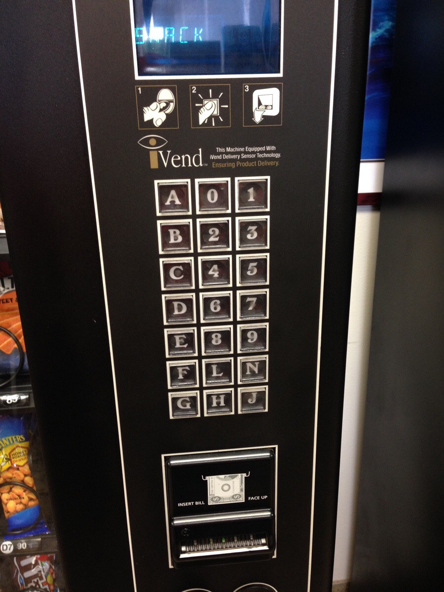

# Usability and design of interfaces

## Andre Nanninga

### Example 1: Vending machine

#### Goal

The goal when operating a vending machine is to get a snack or other prepackaged food from the machine.

#### Interface provided

For this particular vending machine the interface as shown above is provided to make a selection of whatever item you would like to see.

It shows three numbered icons that tell you the steps you must preform to accomplish the goal. Underneath these icons is a keyboard/numpad with which you can select the code of the item you would like to buy.

#### Result

When following the steps the feedback provided is good overall. As soon as you make a selection it is possible to see that the item is being retrieved and when it falls you can easily determine how to get your item.