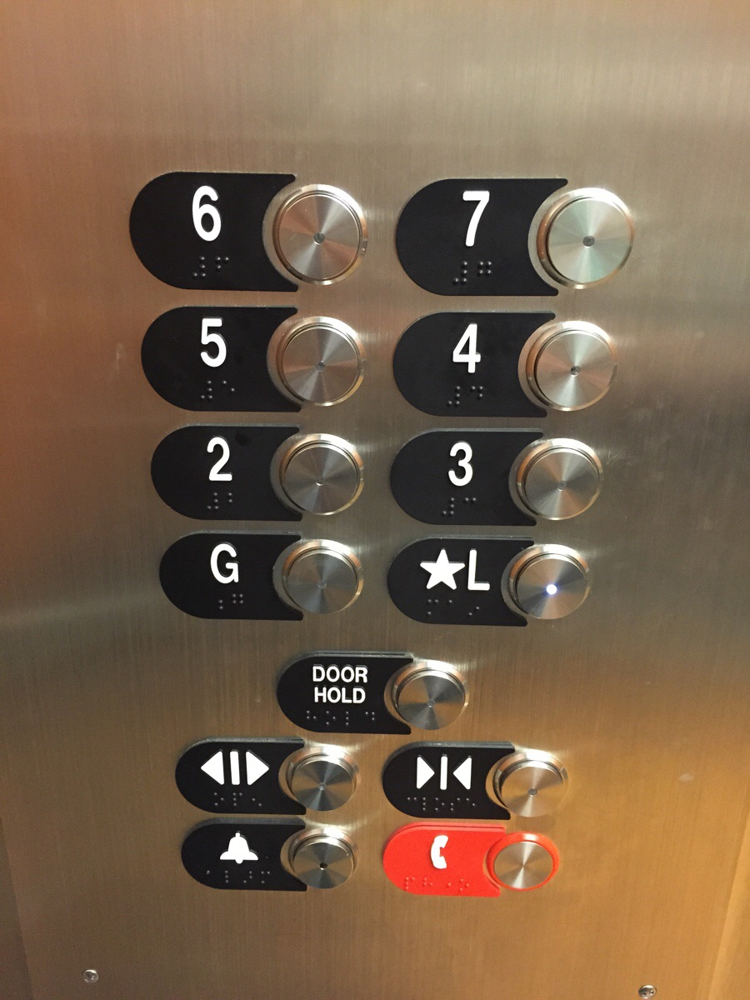

# Usability and design of interfaces

## Andre Nanninga

### Example 1: Vending machine

#### Goal

The goal when operating a vending machine is to get a snack or other prepackaged food from the machine.

#### Interface provided

For this particular vending machine the interface as shown above is provided to make a selection of whatever item you would like to see.

It shows three numbered icons that tell you the steps you must preform to accomplish the goal. Underneath these icons is a keyboard/numpad with which you can select the code of the item you would like to buy.

The biggest issue presented here is the keyboard/numpad. It consists of both letters and number but both are presented in an unfamiliar and illogical manner. The left column of the keyboard contains the letters _A_ to _G_. At the bottom however there are two rows of additional letters namely: _L N H_ and _J_. these rows not only have a different layout than the rest of the keyboard they also don't seem to follow any pattern. A user would not expect these letters and not in that location.

The numbers also have a different layout, they are spread over two columns and five rows in a zig-zag pattern. This pattern is inconsistent with the pattern(s) used for the letters and thus creates another point of difficulty for the user.

#### Result

The steps to buy an item are pretty straightforward and clearly indicated. The difficulty of using this machine however lay in the design of the keyboard/numpad. Once this barrier is overcome the use gets clear feedback in the form of the physical dropping of the chosen item in the retrieval bin. This drop also makes it clear in a physical manner where the item can be retrieved.

#### Usability principle

For a vending machine the usability principles that is most important is _consistency_. A vending machine is mostly used by users who want a quick snack and are usually in a hurry. When a vending machine has good external consistency it is much easy for a user to quickly select whatever item they would want and get on with their day.

With the illogical keyboard/numpad it is not hard to imagine a user making the wrong selection. This is especially annoying when you consider that there is no way to get your money back or exchange the wrong item for the item that you do want.

#### Usability design rule

unfortunately _consistency_ is a usability principle that is mostly ignored in the design of the keyboard/numpad. It lacks both internal and external consistency. The keyboard/numpad is designed in a manner that is no way common or familiar but internally it also lack a consistent pattern. A good example of the lakc of a consistent pattern is that the letters start with _A_ to _G_ and then are followed by the letters _L N H_ and _J_. There is no viable reason why the second set of letters are not the alphabetical letter a user would expect and the layout is also highly unusual.

#### Conclusions

The inconsistent keyboard/numpad make this "simple" machine very hard to operate. The possibility to make an error and receive the wrong item is very high and can make the user very frustrated. This is never a good thing as good design should never stand in the way of whater the goal is of the user.

### Example 2: Elevator

#### Goal

The goal a user has when using an elevator is to quickly and effortlessly move between different floors of a building.

#### Interface provided

The interface provides the user with a number of different floors which can be reached by the elevator. The floors are numbered _2_ to _7_ together with two other floors labeled as _G_ and _*L_. Beneath the buttons for the floor there are a number of buttons to open or close the doors and two buttons for cases of emergencies.

While the interface should be mostly familiar to most users it does present some difficulties with the way the floors are ordered. The order does have a kind of logic behind, namely a zig-zag pattern with each row continuing in a different direction, but this is a pattern that is not immediately clear and may confuse the user. Furthermore the floors _G_ and _*L_ may not be clear to all users, _G_ might indicate the Ground floor but could also be something is. For the _*L_ it is even more difficult because of the _*_ that may not mean anything to the user as it is not commonly seen on an elevator control panel.

#### Result

When pressing a button it gives both physical feedback in the form of being pressable and the light on button will light up. These two forms of feedback make it very clear what action the user has selected and what the elevator will do.

#### Usability principle

For this control panel the principle of _feedback_ has been incorporated in a very good manner. The buttons provide feedback in multiple ways making it entirely clear to the user what action is being taken. Also the principle of _mapping_ is used very good. The labels for each button are clear and provided in both a visual way and in the form of braille for visually impared people. However the use of the floor labels _G_ and _*L_ may prove difficult for some users who are unfamiliar with these letters in the context of an elevator.

_Consistency_ is also an important factor for the design of the control panel. It does show good internal consistency, a pattern was chosen and the layout follows it precisely. The external consistency is not very good, the pattern that was choosing for the floor numbers is a pattern that is not often seen and thus will be confusing for users that are used to more traditional patterns.

#### Conclusions

The design of this elevator control panel is clear and the feedback given when taking an action is very good. However the unusual pattern for the floor buttons may form a barrier for first time users.